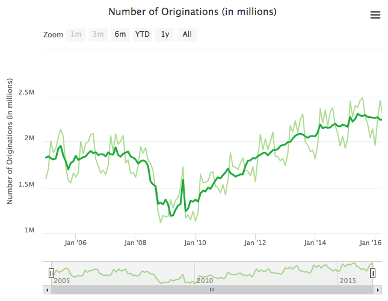

# CFPB Chart Builder [](https://travis-ci.org/cfpb/cfpb-chart-builder)

[](https://saucelabs.com/u/cct-sauce)

Charts for the [Consumer Financial Protection Bureau](https://cfpb.github.io/).

## Usage

Add a `div` with a class of `cfpb-chart` and the following data attributes to your page:

```
<div class="cfpb-chart"
     data-chart-type="line"
     data-chart-title="Number of Originations (in millions)"
     data-chart-description="Auto loan originations decreased in 2016."
     data-chart-source="consumer-credit-trends/auto-loans.csv">
     Auto loan originations decreased in 2016.
</div>
```

Add this library to your page:

```
<script type="text/javascript" src="dist/cfpb-chart-builder.min.js"></script>
```

It'll generate a chart for you:



It can also do column charts and maps.

## Configuration

TBD

## Contributing

1. Clone this repository.
1. `npm install`
1. `npm run watch` to bundle the JS and output it to `dist/`.
1. `npm start` to serve the test directory.
1. Open `http://localhost:8088/test` in a browser to see the test page with a dozen random charts on it.
1. Whenever a JS file in `src/` is edited, the JS will be rebundled. Refresh the page.

Before publishing a new version of the module to npm, run `npm run build` to minify the assets in `dist/`.
Visit `http://localhost:8088/test/all-charts.html` to see *all* the CCT charts.

## Testing

Sauce Labs is used to test the charts in IE 8 through 10.
An [Open Sauce](https://saucelabs.com/open-source) account has been created for this repo.
The `curl` command below will grab the credentials for you.

1. `curl -o test/config.json https://GHE/raw/gist/contolini/504ea71f6a19c74090c7a150aff60421/raw/b3850abab5466af62406d3f0d7a3da05f7f92124/config.json`
1. `npm test`

The browser tests will take several minutes to run.
The test script simply loads `http://localhost:8088/test` in IE VMs and reports any `window` errors.

## Open source licensing info
1. [TERMS](TERMS.md)
2. [LICENSE](LICENSE)
3. [CFPB Source Code Policy](https://github.com/cfpb/source-code-policy/)
